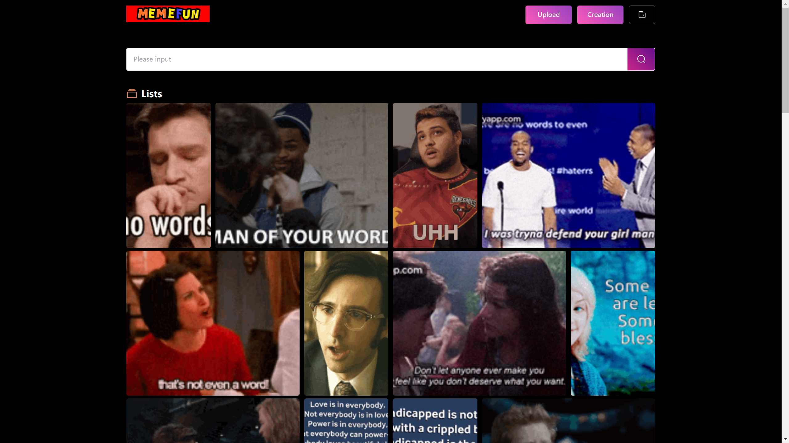
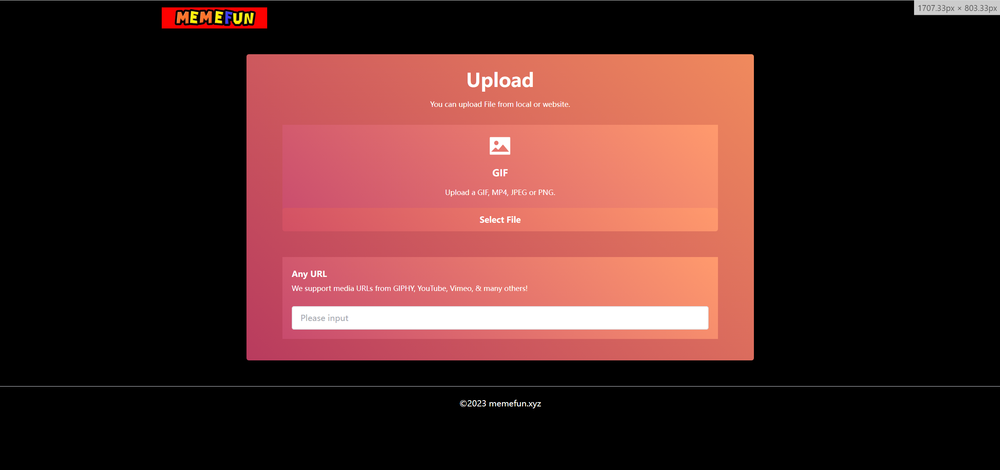
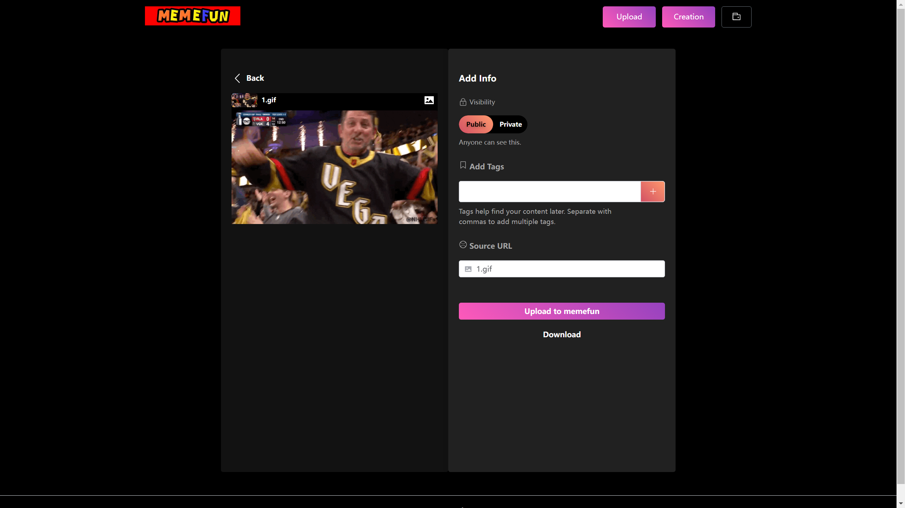
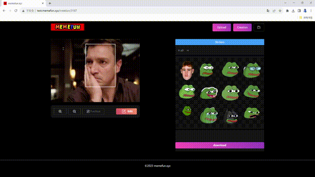

# ArtifyMotion

This is a platform for creative remixing of GIFs and images, where you can perform actions such as face swapping and adding text to GIFs and images. The platform offers a variety of GIFs and images, along with customizable assets for replacement, and users can also upload their own GIFs and replacement materials.
## Hardware

* **OS**: CentOS 7x64
* **CPU**: 4 cores, 8 threads
* **Memory**：8G
* **Bandwidth**：10M

## Development Environment

* Server：Nginx
* Backend：Django, MySQL8.0
* Frontend：Vue3, npm@9.7.2, node@v20.4.0

## Pages

### Material List Page

### Material Upload Page

### Creation Page

### Website
[memefun (http://www.memefun.xyz)](http://www.memefun.xyz)
